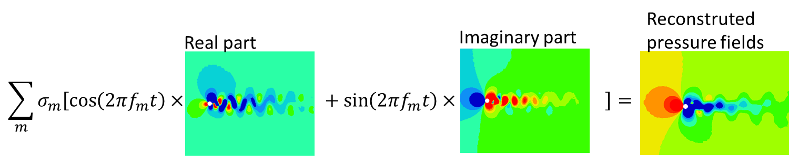

= Décomposition Modale Dynamique
:stem: 

[[rappel-proper-orthogonal-decomposition]]
= Rappel : Proper Orthogonal Decomposition

La POD permet de dissocier les structures qui sont énergétiquement corrélées dans l’écoulement. Chaque mode est associé à une amplitude correspondant à l’apport énergétique du mode dans l’écoulement. L’approche classique est basée sur le calcul de corrélation spatiale dans l’écoulement : on calcul à chaque instant, la corrélation de chaque capteur avec tous les autres. Ainsi, la matrice de corrélation sur laquelle les vecteurs propres et valeurs propres sont calculées, est de taille latexmath:[$n_{x} \times n_{x}$] (latexmath:[$n_{x}$]étant le nombre de capteur). Cette approche est adaptée aux bases de données avec un échantillonnage spatial plus petit que l’échantillonnage temporel notamment en expérimental.

L’approche « POD snapshot » proposée par Sirovich [1], est basée sur le calcul de corrélations temporelles : on calcul pour chaque capteur, la corrélation de l’instant t avec tous les autres instants. La matrice de corrélation définie dans Eq. 2, est donc de taille latexmath:[$n_{t} \times n_{t}$] (latexmath:[$n_{t}$] étant le nombre de snapshots).Cette approche est adaptée aux bases de données avec un échantillonnage temporel plus petit que l’échantillonnage spatial comme c’est le cas en CFD.

*Algorithme : *

1.  Extraction des champs fluctuants :

____________________________________________________________________________________________________________________________________________________________
latexmath:[P\left( t_{i},\overrightarrow{x} \right) = \overline{P}\left( \overrightarrow{x} \right) + P'\left( t_{i},\overrightarrow{x}\  \right)] Eq. 1
____________________________________________________________________________________________________________________________________________________________

1.  Calcul de la matrice de corrélation R sur les champs fluctuants :

________________________________________________________________________________________________________________________________________________________________
latexmath:[$\ R_{\text{ij}} = \frac{1}{N_{x}} < P^{'}\left( t_{i},\overrightarrow{x} \right)\  \cdot P^{'}\left( t_{j},\overrightarrow{x} \right)\  > \ $] Eq. 2
________________________________________________________________________________________________________________________________________________________________

1.  Calcul des vecteurs latexmath:[$\Psi_{m}$] et valeurs propres latexmath:[$\lambda_{m}$] :

___________________________________________________
latexmath:[$R\Psi_{m} = \lambda_{m}\Psi_{m}$] Eq. 3
___________________________________________________

1.  Obtention des modes POD par projection des vecteurs propres sur la matrice des champs fluctuants :

____________________________________________________________________________________________________________________________________________________
latexmath:[$\Phi_{m}\left( \overrightarrow{x} \right) = \sum_{i = 1}^{n_{t}}{< P'\left( t_{i},\overrightarrow{x} \right)\  \cdot \Psi_{m} >}$] Eq. 4
____________________________________________________________________________________________________________________________________________________

1.  Résolution de l’évolution temporelle associée à chaque mode:

________________________________________________________________________________________________________________________________________________
latexmath:[$a_{m}\left( t_{k} \right) = < P^{'}\left( t_{k},\overrightarrow{x} \right) \cdot \Phi_{m}\left( \overrightarrow{x} \right) >$] Eq. 5
________________________________________________________________________________________________________________________________________________

1.  Reconstruction:

_____________________________________________________________________________________________________________________________________________________________________
latexmath:[$P_{\text{rec}}^{'}\left( t_{k},\overrightarrow{x} \right) = \sum_{m = 1}^{N}{a_{m}\left( t_{k} \right).\Phi_{m}\left( \overrightarrow{x} \right)}$] Eq. 6
_____________________________________________________________________________________________________________________________________________________________________

Le résidu est estimé en calculant la norme entre le champ fluctuant initial et le champ reconstruit.

_____________________________________________________________________________________________________________________________________________
latexmath:[$\epsilon = ||P^{'}\left( t_{i},\overrightarrow{x} \right) - P_{\text{rec}}^{'}\left( t_{i},\overrightarrow{x} \right)||\ $] Eq. 7
_____________________________________________________________________________________________________________________________________________

*Avantages, limitations et difficultés*

D’un point de vue programmation, le calcul de la matrice corrélation R est la partie la plus délicate de l’algorithme. En séquentiel, sa résolution se fait en latexmath:[$O\left( n_{t}^{2} \right)$] par rapport au temps de lecture des données de chaque snapshot. La lecture de plusieurs snapshots en parallèle n’est pas envisageable pour la gestion de la RAM compte tenu de la taille de la base de données.

La décomposition de domaine est une solution appropriée pour faciliter cette étape car par linéarité du produit scalaire, la matrice de corrélation R est égale à la somme des matrices de corrélation de chaque sous domaine latexmath:[$SD_{k}$] :

latexmath:[$R_{\text{ij}} = \frac{1}{n_{x}} < P^{'}\left( t_{i},\overrightarrow{x} \right)\  \cdot P^{'}\left( t_{j},\overrightarrow{x} \right)\  > \  = \frac{1}{n_{x}}\sum_{SD_{k}}^{N_{\text{SD}}}{< P^{'}\left( t_{i},\overrightarrow{x}|_{SD_{k}} \right)\  \cdot P^{'}\left( t_{j},\overrightarrow{x}|_{SD_{k}} \right)\  >} = \frac{1}{n_{x}}\sum_{SD_{k}}^{N_{\text{SD}}}R_{\text{ij}}^{SD_{k}}$]Eq. 8

Avec latexmath:[$N_{\text{SD}}$] le nombre de sous domaines.

De cette façon, en faisant l’hypothèse qu’on peut charger en mémoire les data d’un sous-domaine à tous les instants, le temps de résolution de la matrice de corrélation peut être réduit à latexmath:[$O\left( N_{\text{SD}} \times n_{t} \right)$].

La POD est un outil efficace pour l’analyse d’écoulement car il permet d’extraire les structures cohérentes de l’écoulement. Cependant, la composante spectrale de chaque mode peut être complexe et ne permet pas de caractériser de façon efficace les échelles de turbulence à contrôler. Elle est toutefois utilisée comme base pour le développement de la Décomposition Modale Dynamique.

[[décomposition-modale-dynamique-basée-sur-la-matrice-de-corrélation]]
= Décomposition Modale dynamique basée sur la matrice de corrélation

La décomposition modale dynamique est une méthode permettant d’extraire les structures de l’écoulement qui évoluent en phase. Si cette approche ne nécessite pas une décomposition orthogonale, elle a l’avantage d’isoler les phénomènes fréquentiels. Elle est basée sur l’existence d’une décomposition linéaire des snapshots de l’écoulement. L’algorithme basé sur la matrice de corrélation ([2, 3]) consiste à calculer les coefficients de la décomposition linéaire sur les vecteurs de la matrice corrélation Eq. 10. Cela permet d’effectuer le calcul de vecteurs propres et valeurs propres Eq. 12 sur une matrice de taille latexmath:[$\left( n_{t} - 1 \right) \times \left( n_{t} - 1 \right)$].

*Algorithme : *

1.  Calcul de la matrice de corrélation R sur le champ instantané:

________________________________________________________________________________________________________________________________________________________
latexmath:[$\ R_{\text{ij}} = \frac{1}{n_{x}} < P\left( t_{i},\overrightarrow{x} \right)\  \cdot P\left( t_{j},\overrightarrow{x} \right)\  > \ $] Eq. 9
________________________________________________________________________________________________________________________________________________________

1.  Décomposition linéaire du dernier vecteur de la matrice corrélation en fonction des autres colonnes :

_____________________________________________________________________
latexmath:[$R_{n_{t}} = \Sigma_{i = 1}^{n_{t} - 1}c_{i}R_{i}$] Eq. 10
_____________________________________________________________________

1.  Construction de la matrice compagnon :

_______________________________
latexmath:[$C = \begin{pmatrix}
0 & \ldots & 0 & c_{1} \\
1 & 0 & 0 & \vdots \\
0 & \ddots & 0 & \vdots \\
0 & 0 & 1 & c_{n_{t} - 1\ } \\
\end{pmatrix}$] Eq. 11
_______________________________

1.  Calcul des vecteurs latexmath:[$\Psi_{m}$] et valeurs propres latexmath:[$\lambda_{m}$] de la matrice compagnon :

____________________________________________________________
latexmath:[$\text{C.}\Psi_{m} = \lambda_{m}\Psi_{m}$] Eq. 12
____________________________________________________________

1.  Obtention des modes DMD par projection des vecteurs propres sur la matrice des champs instantanés :

_______________________________________________________________________________________________________________________________________________
latexmath:[$\Phi_{m}\left( \overrightarrow{x} \right) = \Sigma_{i = 0\ } < P\left( t_{i},\overrightarrow{x} \right)\  \cdot \Psi_{m} >$] Eq. 13
_______________________________________________________________________________________________________________________________________________

1.  Déduction de l’évolution temporelle des modes par :

________________________________________________________________________________________________
latexmath:[$a_{m}\left( k.\text{Δt} \right)\mathfrak{= R}\left( \lambda_{m}^{k} \right)$] Eq. 14
________________________________________________________________________________________________

Avec latexmath:[$f_{m} = \frac{\mathfrak{I(}\ln{(\lambda_{m}))}}{2\pi\Delta t}$] la fréquence et latexmath:[$\sigma_{m} = \frac{\mathfrak{R}\left( \ln\left( \lambda_{m} \right) \right)}{\Delta t}$] le taux de croissance associées au mode latexmath:[$m$].

1.  Reconstruction

_____________________________________________________________________________________________________________________________________
latexmath:[$P\left( t_{k} \right) = \sum_{m = 1}^{N - 1}{a_{m}\left( t_{k} \right)\Phi_{m}\left( \overrightarrow{x} \right)}$] Eq. 15
_____________________________________________________________________________________________________________________________________

*Avantages, limitation et difficultés*

Ainsi la contribution de chaque mode dans le champ reconstruit correspond à une variation périodique à la fréquence latexmath:[$f_{m}$], amortie ou amplifiée avec un taux latexmath:[$\sigma_{m}$]. Ainsi les modes à taux de croissance proche de zéro sont associés aux phénomènes strictement périodiques, les modes avec des taux de croissance positifs peuvent être associés à des instabilités participant à la production d’énergie de la turbulence tandis que ceux avec des taux de croissance négatifs participent au déclin d’énergie de la turbulence.

De plus, les modes sont à valeurs complexes permettant de décrire la phase spatiale des phénomènes isolés. La reconstruction peut ainsi être schématisée comme illustrée sur les figures 1 et 2:

image:images/media/image1.png[image,width=566,height=99]

Figure 1: Exemple de reconstruction obtenu sur le Corps d'Ahmed à 47° avec Matlab

Figure 2: Exemple de reconstruction obtenue sur le sillage d'un cylindre avec Feel++

Avec cet algorithme, l’étape de décomposition linéaire du dernier vecteur de la matrice de corrélation a pour inconvénient de propager l’incertitude au calcul de l’intégralité des modes. Le résultat DMD ainsi obtenu est bruité et difficilement exploitable.

[[sparse-promoting-dynamic-modal-decomposition]]
= Sparse Promoting Dynamic Modal Decomposition

D’autres méthodes basées sur une étape préliminaire de décomposition en valeurs singulières permettent d’obtenir une décomposition linéaire plus fiable ([3, 4]). Le but est de répartir l’incertitude sur l’ensemble de la base de données utilisée. Avec cette méthode, la déduction des composantes temporelles n’est plus immédiate mais doit être résolue par un algorithme de minimisation du résidu entre les champs instantanés et les champs reconstruits. L’algorithme « Sparse Promoting DMD » proposé par Schmid [5] et Jovanovic [6] va plus loin en proposant de résoudre ce problème de minimisation sous contrainte de maximiser le nombre de modes à amplitudes nulles. L’information modale est donc concentrée dans un nombre minimal de modes facilitant ainsi la construction de la base réduite.

*Algorithme : *

Soit latexmath:[$\Psi_{0} = \left\lbrack P_{0}\ldots P_{N - 1} \right\rbrack$] et latexmath:[$\Psi_{1} = \left\lbrack P_{1}\ldots P_{N} \right\rbrack$] les matrices snapshots utilisées pour effectuer la décomposition linéaire : latexmath:[$\Psi_{1} = A\Psi_{0}$].

latexmath:[\[\begin{bmatrix}
| & | & | & | & | \\
P_{0} & P_{1} & \cdots & P_{N - 1} & P_{N} \\
| & | & | & | & | \\
\end{bmatrix}\]]

La matrice DMD latexmath:[$F_{\text{dmd}}$] est une représentation de la matrice A projetée dans la base des modes propres orthogonaux tel que :

___________________________________________________
latexmath:[$A \approx UF_{\text{dmd}}U^{*}$] Eq. 16
___________________________________________________

Avec latexmath:[$U$] la matrice de vecteurs propres de la POD classique.

1.  Décomposition SVD de latexmath:[$\Psi_{0}$] :

_____________________________________________
latexmath:[$\Psi_{0} = U\Sigma V^{*}$] Eq. 17
_____________________________________________

1.  Construction de la matrice DMD :

________________________________________________________________
latexmath:[$F_{\text{dmd}} = U^{*}\Psi_{1}V\Sigma^{- 1}$] Eq. 18
________________________________________________________________

1.  Calcul des vecteurs latexmath:[$Y_{m}$] et valeurs propres latexmath:[$\lambda_{m}$] :

_______________________________________________________
latexmath:[$F_{\text{dmd}}Y_{m} = \lambda_{m}Y$] Eq. 19
_______________________________________________________

1.  Obtention des modes DMD par projection des vecteurs propres sur la matrice des champs instantanés :

_______________________________________________________________________
latexmath:[$\Phi_{m}\left( \overrightarrow{x} \right) = UY_{m}$] Eq. 20
_______________________________________________________________________

1.  Obtention des composantes temporelles par minimisation de la fonctionnelle de Lagrange latexmath:[$\mathcal{L}$] définie comme suit (« dual ascend method iterative algorithm »)

____________________________________________________________________________________________________
latexmath:[$\mathcal{L =}J\left( a \right) + \gamma\sum_{m = 1}^{N - 1}\left| a_{m} \right|$] Eq. 21
____________________________________________________________________________________________________

Avec

latexmath:[$J\left( \alpha \right)$]: la fonction coût correspondant à la norme du

latexmath:[$\gamma$]: le multiplicateur de Lagrange

Selon Jovanovic [6], la fonction coût s’exprime comme suit:

__________________________________________________________________________________
latexmath:[$J\left( a \right) = a^{*}\widetilde{P}a - q^{*}a - a^{*}q + s$] Eq. 22
__________________________________________________________________________________

Avec

latexmath:[$\widetilde{P} = \left( Y^{*}Y \right) \circ \left( \overline{V_{\text{and}}V_{\text{and}}^{*}} \right)$]

latexmath:[$q = \overline{\text{diag\ }\left( V_{\text{and}}V\Sigma^{*}Y \right)}$]

latexmath:[$s = trace\left( \Sigma^{*}\Sigma \right)$]

latexmath:[$V_{\text{and}}$] la matrice Vandermonde construit à partir des valeurs propres : latexmath:[$V_{\text{and}} = \begin{bmatrix}
1 & \lambda_{1} & \cdots & \lambda_{1}^{N - 1} \\
1 & \lambda_{2} & \cdots & \lambda_{2}^{N - 1} \\
 \vdots & \vdots & \ddots & \vdots \\
1 & \lambda_{r} & \cdots & \lambda_{r}^{N - 1} \\
\end{bmatrix}$]

*Avantages, limitation et difficultés*

La difficulté de cet algorithme se concentre dans la décomposition SVD de latexmath:[$\Psi_{0}$] de taille latexmath:[$n_{x} \times \left( n_{t} - 1 \right)$] qu’il est impossible de charger en mémoire dans son intégralité.

Cependant, U et V peuvent être obtenus par calcul des vecteurs propres des matrices de corrélation spatiale latexmath:[$R_{x} = \Psi_{0}.\Psi_{0}^{T}$] (de taille latexmath:[$n_{x} \times n_{x}$]) et temporelle latexmath:[$R_{t} = \Psi_{0}^{T}.\Psi_{0}$] (de taille latexmath:[$n_{t} \times n_{t}$]).

Pour une base de données telle que latexmath:[$n_{x} \gg n_{t}$], il est préférable de déduire U par : latexmath:[$U = \Psi_{0}\ V^{T}\Sigma$]

Ainsi, cet algorithme nécessite un calcul matriciel intense, ce que permet les librairies Eigen, inclues dans Feel++.

*Algorithme : Parallel Sparse Promoting Dynamic Modal Decomposition*

Déclaration:

latexmath:[$n_{t}$] : le nombre de de snapshots

latexmath:[$n_{x}$] : le nombre de nœuds

latexmath:[$n_{\text{SD}}$] : le nombre de sous-domaines

latexmath:[$n_{\text{xp}}$] : le nombre de nœuds par sous-domaine tel que latexmath:[$n_{x} = n_{\text{SD}} \times n_{\text{xp}}$]

latexmath:[$\Psi_{0}$], latexmath:[$\Psi_{1}$] : les matrices snapshots de taille latexmath:[$\left\lbrack n_{x}\ ;\ n_{t} - 1 \right\rbrack$]

latexmath:[$\Psi_{0}^{\text{SD}}$], latexmath:[$\Psi_{1}^{\text{SD}}$] : les data des snapshots par sous-domaine, de taille latexmath:[$\left\lbrack n_{\text{xp}}\ ;\ n_{t} - 1 \right\rbrack$]

Main:

* Pour chaque sous-domaine, faire :

\{

* Lecture data latexmath:[$\Psi_{0}^{\text{SD}}$] de taille latexmath:[$\left\lbrack n_{\text{xp}}\ ;\ n_{t} - 1\  \right\rbrack$]
* Décomposition QR du sous-domaine : latexmath:[$\Psi_{0}^{\text{SD}} = Q_{\text{tmp}}^{\text{SD}}.R_{\text{tmp}}^{\text{SD}}$] avec latexmath:[$Q_{\text{tmp}}^{\text{SD}}$] de taille latexmath:[$\left\lbrack n_{\text{xp}}\ ;n_{t} - 1 \right\rbrack$] et latexmath:[$R_{\text{tmp}}^{\text{SD}}$] de taille latexmath:[$\left\lbrack n_{t} - 1\ ;n_{t} - 1 \right\rbrack$]
* Ecriture de latexmath:[$Q_{\text{tmp}}^{\text{SD}}$]
* Remplissage de latexmath:[$R_{\text{prime}} = \begin{bmatrix}
R_{\text{tmp}}^{SD1} \\
 \vdots \\
R_{\text{tmp}}^{\text{SD}} \\
\end{bmatrix}$] de taille latexmath:[$\left\lbrack n_{\text{SD}} \times \left( n_{t} - 1 \right)\ ;n_{t} - 1\  \right\rbrack$]

}

* Décomposition QR de latexmath:[$R_{\text{prime}} = Q_{\text{prime}}.R_{\text{end}}$] avec latexmath:[$Q_{\text{prime}}$] de taille latexmath:[$\left\lbrack n_{\text{SD}} \times \left( n_{t} - 1 \right)\ ;n_{t} - 1\  \right\rbrack$] et latexmath:[$R_{\text{end}}$] de taille latexmath:[$\left\lbrack n_{t} - 1\ ;n_{t} - 1 \right\rbrack$]
* SVD of latexmath:[$R_{\text{end}} = u_{\text{tmp}}\text{.s.vt}$] avec latexmath:[$u_{\text{tmp}}$] et latexmath:[$vt$] de taille latexmath:[$\left\lbrack n_{t} - 1\ ;n_{t} - 1 \right\rbrack$] et s de taille latexmath:[$\lbrack n_{t} - 1\rbrack$]
* Pour chaque sous-domaine, faire :

\{

* Lecture de latexmath:[$Q_{\text{tmp}}^{\text{SD}}$]
* Extraction de latexmath:[$Q_{\text{prime}}^{\text{SD}}$] de latexmath:[$Q_{\text{prime}}$], de taille latexmath:[$\left\lbrack n_{t} - 1\ ;n_{t} - 1 \right\rbrack$]
* Calcul de latexmath:[$Q^{\text{SD}} = Q_{\text{tmp}}^{\text{SD}}.Q_{\text{prime}}^{\text{SD}}$] de taille latexmath:[$\left\lbrack n_{\text{xp}}\ ;n_{t} - 1 \right\rbrack$]
* Suppression des fichiers latexmath:[$Q_{\text{tmp}}^{\text{SD}}$]
* Calcul de latexmath:[$u^{\text{SD}} = Q^{\text{SD}}.u_{\text{tmp}}$] de taille latexmath:[$\left\lbrack n_{\text{xp}}\ ;n_{t} - 1\  \right\rbrack$]
* Ecriture de latexmath:[$u^{\text{SD}}$]
* Lecture data latexmath:[$\Psi_{1}^{\text{SD}}$]
* Calcul de latexmath:[$\text{u.}\Psi_{1} + = u^{SD'}.\Psi_{1}^{\text{SD}}$] de taille latexmath:[$\left\lbrack n_{t} - 1\ ;n_{t} - 1 \right\rbrack$]

}

* Ecriture de latexmath:[$\text{u.}\Psi_{1}$]
* Calcul de latexmath:[$\text{u.}\Psi_{1}.vt'$] de taille latexmath:[$\left\lbrack n_{t} - 1\ ;n_{t} - 1 \right\rbrack$]
* Résolution de latexmath:[$\left( \text{u.}\Psi_{1}\text{.v}t^{'} \right).Y = \lambda.s.Y$] avec latexmath:[$Y$] de taille latexmath:[$\left\lbrack n_{t} - 1\ ;n_{t} - 1 \right\rbrack$]
* Ecriture de latexmath:[$Y$] et latexmath:[$\lambda$]
* Pour chaque sous-domaine, faire :

\{

* Lecture de latexmath:[$u^{\text{SD}}$]
* Projection des modes par sous-domaine latexmath:[$\Phi^{\text{SD}} = u^{\text{SD}}\text{.Y}$] de taille latexmath:[$\left\lbrack n_{\text{xp}}\ ;n_{t} - 1\  \right\rbrack$]
* Ecriture des modes latexmath:[$\Phi^{\text{SD}}$]

}

[[dynamic-modal-decomposition-with-control]]
= Dynamic Modal Decomposition with control

La méthode DMD avec contrôle, proposée par Proctor et al. [7] consiste à prendre en compte la loi de contrôle d’écoulement dans la résolution de la base modale. On peut ainsi obtenir un modèle réduit capable de prédire la modification de l’écoulement en fonction des paramètres de contrôle en dynamique. Cette méthode se base sur la décomposition linéaire des matrices snapshots concaténées avec la loi de commandes des actionneurs Eq. 23.

_____________________________________________________
latexmath:[$\Psi_{1} = A\Psi_{0} + B\Upsilon$] Eq. 23
_____________________________________________________

Avec latexmath:[$\Upsilon$] l’évolution temporelle des actionneurs (conditions limites type inflow)

A terme, cette approche permettra la construction d’une loi d’état pour le contrôle boucle fermée de l’écoulement de sillage pour la réduction de traînée d’une maquette de véhicule (Corps d’Ahmed 47° ou véhicule SUV générique).

[[references]]
= References

[1] L. Sirovich,Turbulence and the dynamics of coherent structures. I. Coherent structures, Quarterly of applied mathematics 45 (3), 561-571, 1987

[2] Frederich O, Luchtenburg DM. Modal analysis of complex turbulent flow. The 7th International Symposium on Turbulence and Shear Flow Phenomena (TSFP-7), Ottawa, Canada,, 2011.

[3] Tissot G. (2014). _Réduction de modèle et contrôle d´écoulements_, PhD thesis, University of Poitiers, France.

[4] D. J Parkin, M. C Thomson,. J. Sheridan, “Numerical analysis of bluff body wakes under periodic open-loop control”. In: J. Fluid Mech, vol. 739, pp. 94-123, 2014

[5]. Schmid P.J. (2010). Dynamic mode decomposition of numerical and experimental data, _J. Fluid. Mech._, Cambridge University Press, Cambridge, UK__,__ vol. 656, pp. 5–28.

[6] Mihailo R. Jovanovic, Peter J. Schmid, Joseph W. Nichols. Sparsity-promoting dynamic mode decomposition. Physics of Fluids, American Institute of Physics, 2014, 26 (2).

[7] JL Proctor, SL Brunton, JN Kutz, https://scholar.google.com/citations?view_op=view_citation&hl=en&user=AnXaLe0AAAAJ&citation_for_view=AnXaLe0AAAAJ:2osOgNQ5qMEC[Dynamic mode decomposition with control], SIAM Journal on Applied Dynamical Systems 15 (1), 142-161
